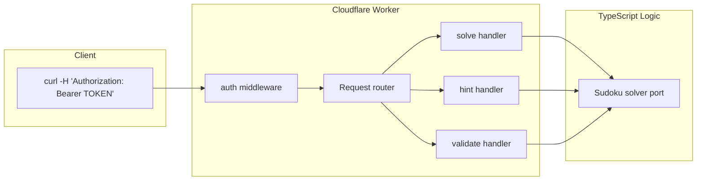

# Feature Implementation Plan

**Overall Progress:** `100%`

## Sudoku REST API – Cloudflare Worker

## Architecture Overview




## Key Decisions

- **Board input**: `?board=` query parameter (81-char string, `0` or `.` for blanks)
- **Validate response**: `valid: boolean`, `message: string`, and `reasons: Array<{type, detail}>` for invalid boards
- **Bearer token**: Stored as Wrangler secret `BEARER_TOKEN`; checked via `Authorization: Bearer <token>`
- **No Python/numpy**: Port solver to pure TypeScript (plain arrays); Workers run in V8, no Python runtime

---

## 1. Project Setup

Initialize a Cloudflare Worker project:

```bash
cd SudokuSolverAPI
npm create cloudflare@latest . -- --framework=none --typescript=strict --no-deploy
npm pkg set type=module
```

Create `wrangler.toml` with `vars`/`compatibility_date`, and document `BEARER_TOKEN` secret for deployment.

---

## 2. Port Sudoku Solver to TypeScript

Create `src/sudoku.ts` porting the logic from [sudoku.py](https://github.com/wsabol/SudokuSolver/blob/main/sudoku_solver/sudoku.py):

- **Board format**: 9x9 `number[][]`; parse 81-char string (`0` or `.` = blank)
- **Core methods** (mirror Python API):
  - `parseBoard(s: string): number[][]`
  - `getRow`, `getColumn`, `getBox`, `boxIndex`, `valuesMissing`, `possibles`
  - `isValid()` – boolean
  - `getNextMove(): {row, col, value} | null` – naked/hidden singles
  - `solve(): {board, status}` – `"Unique Solution"` or `Invalid Puzzle (...)`

Use plain arrays; no numpy. Logic can be adapted from the Python implementation.

---

## 3. Validation with Reasons

Add `src/validate.ts` with a `validateBoard(board: number[][]): ValidationResult` that:

- Returns `{ valid: boolean, message: string, reasons: Array<{type, detail}> }`
- Populates `reasons` when invalid:
  - `duplicate_in_row` (row, value)
  - `duplicate_in_column` (col, value)
  - `duplicate_in_box` (box, value)
  - `invalid_value` (row, col, value)
  - `invalid_board_length` (expected 81)
  - `empty_cell_no_candidates` (row, col)

`message` summarizes the first reason or "Valid" if valid.

---

## 4. Auth Middleware

Create `src/auth.ts`:

- Extract `Authorization: Bearer <token>` from the request
- Compare against `env.BEARER_TOKEN` (from Wrangler secrets)
- If missing or wrong: return `401 { error: "Unauthorized" }`
- Otherwise, continue to route handlers

---

## 5. Request Routing and Handlers

Single entry `src/index.ts`:

- Parse `board` from `new URL(req.url).searchParams.get("board")`
- Apply auth middleware; on failure, return 401
- Route by pathname:
  - `GET /solve` → solve handler
  - `GET /hint` → hint handler
  - `GET /validate` → validate handler
- Shared error handling:
  - Missing `board`: `400 { error: "Missing board parameter" }`
  - Invalid length: `400 { error: "Board must be 81 characters" }`
  - Parse errors: `400 { error: "Invalid board format", ... }`

---

## 6. Response Shapes (JSON)


| Endpoint          | Success                                                | Error                   |
| ----------------- | ------------------------------------------------------ | ----------------------- |
| **GET /solve**    | `{ board: number[][], status: string }`                | 400, 401                |
| **GET /hint**     | `{ move: { row, col, value }                           | null, message, board }` |
| **GET /validate** | `{ valid: boolean, message: string, reasons?: [...] }` | 400, 401                |


Board is always a 9x9 array of 0–9. Hint uses 0-based row/col.

---

## 7. File Layout

```
SudokuSolverAPI/
├── src/
│   ├── index.ts      # Worker entry, routing, auth
│   ├── sudoku.ts     # Ported solver logic
│   ├── validate.ts   # Validation with reasons
│   └── auth.ts       # Bearer token check
├── wrangler.toml
├── package.json
├── tsconfig.json
└── README.md
```

---

## 8. Local Development and Deployment

- **Local**: `npx wrangler dev` – set `BEARER_TOKEN` in `.dev.vars` (gitignored)
- **Deploy**: `npx wrangler deploy`; set secret: `npx wrangler secret put BEARER_TOKEN`

---

## 9. Testing Strategy

- Unit tests for `sudoku.ts` (parse, solve, getNextMove, isValid) using a few boards from Sudopedia-style test cases
- Unit tests for `validate.ts` (duplicates, invalid values, empty board)
- Integration tests for `/solve`, `/hint`, `/validate` with and without auth

---

## Dependencies

- **Runtime**: None required (no external packages for solver)
- **Dev**: `wrangler`, `typescript`, `@cloudflare/workers-types`, `vitest` (or similar) for tests

---

## Tasks

- 🟩 **Step 1: Project Setup**
  - 🟩 Initialize Cloudflare Worker (`npm create cloudflare@latest . -- --framework=none --typescript=strict --no-deploy`)
  - 🟩 Set `type=module` in package.json
  - 🟩 Create wrangler.toml with compatibility_date
  - 🟩 Add .dev.vars to .gitignore, document BEARER_TOKEN secret
- 🟩 **Step 2: Port Sudoku Solver (src/sudoku.ts)**
  - 🟩 Review the `Sudoku` class in [https://github.com/wsabol/SudokuSolver](https://github.com/wsabol/SudokuSolver) to perserve the same functionality
  - 🟩 Implement `parseBoard(s: string): number[][]` – 81 chars to 9x9, blanks as 0
  - 🟩 Implement helpers: getRow, getColumn, getBox, boxIndex, valuesMissing, possibles
  - 🟩 Implement `isValid()` – check rows, cols, boxes for duplicates and constraints
  - 🟩 Implement `getNextMove()` – naked/hidden singles, returns `{row,col,value}|null`
  - 🟩 Implement `solve()` – returns `{board, status}` mirroring Python API
- 🟩 **Step 3: Validation with Reasons (src/validate.ts)**
  - 🟩 Implement `validateBoard(board): {valid, message, reasons}`
  - 🟩 Detect: duplicate_in_row, duplicate_in_column, duplicate_in_box, invalid_value, invalid_board_length, empty_cell_no_candidates
  - 🟩 Build summary message from first reason or "Valid"
- 🟩 **Step 4: Auth Middleware (src/auth.ts)**
  - 🟩 Extract `Authorization: Bearer <token>`
  - 🟩 Compare to `env.BEARER_TOKEN`; return 401 JSON on failure
- 🟩 **Step 5: Worker Entry and Routing (src/index.ts)**
  - 🟩 Apply auth to all routes
  - 🟩 Route GET by pathname: /solve, /hint, /validate
  - 🟩 Shared validation: board param present, length 81; return 400 on error
  - 🟩 Implement handlers calling sudoku/validate and returning JSON per spec
- 🟩 **Step 6: README and Deployment Docs**
  - 🟩 Document endpoints, query params, response shapes
  - 🟩 Document `wrangler dev` with .dev.vars and `wrangler secret put BEARER_TOKEN`

